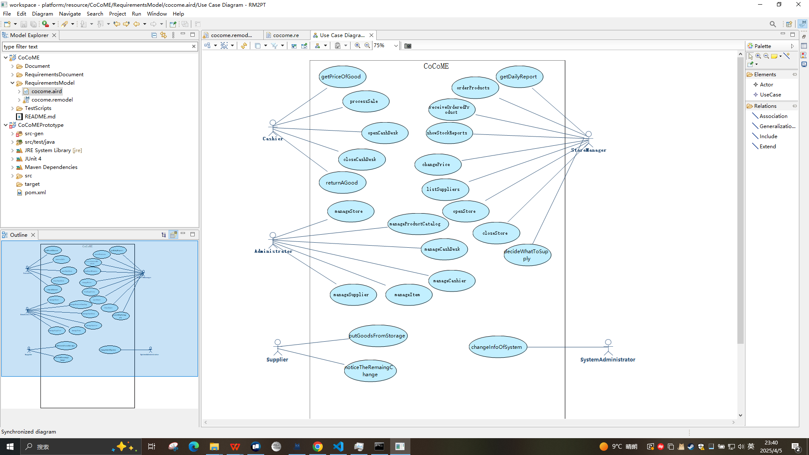
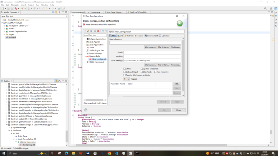
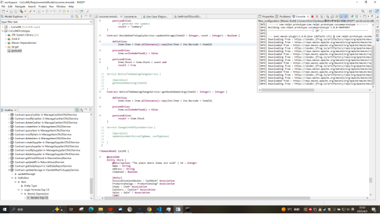
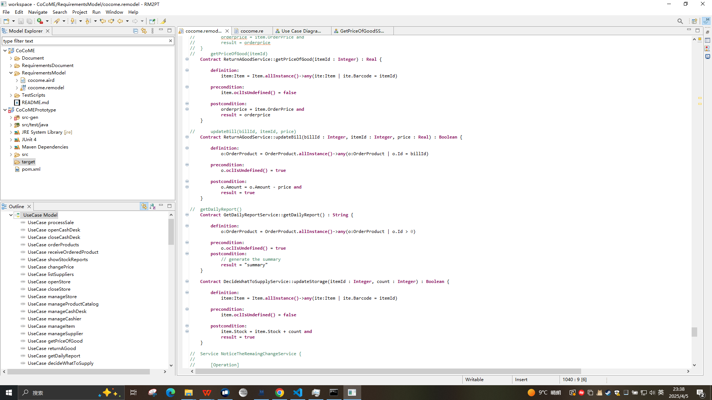

# Summary
- 自然语言需求数量:21
- Actor数量:5
- 用例数量:23
- 系统顺序图数量:10
- 系统操作总数:12
- 系统合约数量:12
- 类数量:13

# CoCoME
该系统的适用对象是收银员、仓库管理员、管理员、系统管理员。
如果他们知道计算机的基本操作，他们就可以使用该系统来操作所需的功能。
也许有些用户需要一些相关的培训。
- 收银员：
    - 获取物品价格
    - 处理订单
    - 打开现金柜
    - 关闭现金柜
    - 退货

- 仓库管理员：
    - 获取每日报告
    - 订货
    - 获取订单
    - 查看余量报告
    - 修改价格
    - 查看货物收发员
    - 开店
    - 关店
    - 决定下单货物内容数量

- 店长：
    - 管理仓库
    - 管理物品目录
    - 管理现金柜
    - 管理收银员
    - 管理货物
    - 管理货物收发员
- 系统管理员：
    - 管理系统信息
    - 处理系统问题
- 货物收发员：
    - 管理货架上货
    - 管理商品余量

